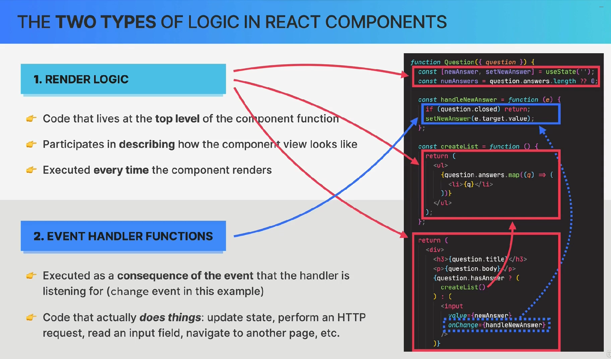

# Описание проектов

- [x] 16.09.23: pizza-menu - статичный сайт, базовые знания о компонентах, rendering list, props, jsx, styles,
  conditional rendering
- [x] 24.09.23: travel list
- [x] 29.09.23: eat-n-split
- [x] reusable star component?
- [ ] usePopcorn - children prop, component composition, Prop Drilling, reusable component, propsTypes, useEffect,
  fetch, debouncer, обработка битых изображений, изменение title use eff, abortion controller, esc keydown event
  listener (глобально слушаем события, подписываемся, отписываемся)

# React в браузере

- песочница https://codesandbox.io/
- в строке поиска набрать <a> react.new </a>
- можно даже ванильный js проект создать <a> js.new </a>

# Зачем нужны фреймворки?

- Для создания общей структуры для проекта
- Для облегчения синхронизации данных с UI (вообще не нужно трогать DOM, селектить, обновлять элементы вручную, они
  обновляются при изменении state)
- Для разделения view (визуала) и state (данных), в чистом JS, данные часто хранятся прямо в DOM

# React и Angular

- Реакт декларативный, Ангуляр императивный ?
- Ванильный js императивный
- В реакте one-way data flow, в ангуляре two-way

# Framework vs Library

## Виабушная аналогия


Фреймворк как набор для приготовления суши

`+` все ингридиенты есть из коробки

`-` нет свободы выбора

Билиотека как отдельные ингридиенты

`+` свобода выбора

`-` необходимо ресерчить и приобретать отдельно

## Реальная разница


# React Library Ecosystem


# React Frameworks


# Snippets

```javascript
// rsf snippet

import React from 'react';

function Challenge1(props) {
    return (
        <div></div>
    );
}

export default Challenge1;
```

# Create React App

В реальных проектах используется Vite, тк create-react-app медленный и устаревший

Инструкция для 5 версии:

```shell
cd <dir-where-app-folder-would-be>
npx create-react-app@5 <app-name>
```

# Создание index.js

1. Импортировать реакт и реакт дом
2. Создать главный компонент
3. Создать корень
4. Отрендерить

StrictMode позволяет проверять компоненты на ошибки или устаревание (используется во время разработки)
В этом режиме код запускается дважды

```javascript
import React from "react";
import ReactDOM from "react-dom/client";

function App() {
    return <h1>Smth</h1>;
}

const root = ReactDOM.createRoot(document.getElementById("root"));
root.render(
    <React.StrictMode>
        <App/>
    </React.StrictMode>
);
```

# Файл менеджмент

Все компоненты лучше держать в папке src/components

Один файл на один компонент

В основном файле импортируются используемые компоненты

```js
import {useState} from 'react';
import Logo from './Logo';
import Form from './Form';
import PackingList from './PackingList';
import Stats from './Stats';

export default function App() {
    // code
}
```

Остальные компоненты надо экспортировать

```js
import {useState} from 'react';
import Item from './Item';

export default function PackingList({props}) {
    // code
}
```

# Components - Компоненты

У каждого компонента есть свои _date, logic and view_

- суть компонентов в переиспользовании их
- имя компонента должно начинаться с большой буквы
- компонент должен возвращать разметку
- все компоненты должны быть объявлены независимо друг от друга (без вложения)

## JSX

- значит JavaScript XML, расширение для js, которое совмещает js, html и css
- определяет как выглядит и работает компонент
- Babel переводит JSX в React.createComponent()

### Особенности


## Styles - Стили

Виды:

- внешние стили
- инлайн стили

### Внешние

Необходимо импортировать их в index.JS файле

- в jsx не class, а className
- стили не относятся к конкретному компоненту, они глобальные как в обычном css

```javascript
import "./index.css";

<header className="header">
    <h1>Fast React Pizza</h1>
</header>
```

### Инлайн

- инлайн стили представляют собой js-объект
- св-ва пишутся в camelCase

```javascript
<div
    style={{
        display: "flex",
        flexDirection: "row",
        gap: "1.2rem",
    }}
></div>
```

## Props - Пропсы

— это объект с входными данными для React-компонентов

- в реакте one-way data flow - данные переходят только сверху вниз (от родителей к детям)
- пропсы read-only (тк являются объектом. Если бы их можно было изменять, то они бы изменялись в родительском компоненте
  тоже)
- могут быть изменены только в родительском компоненте
- если кажется, что хочется изменить props, то необходимо менять state
- при получении новых пропсов, компонент перерендеривается (обычно при перерисовке родительского компонента)

### Передача пропсов

- для передачи всего, кроме строк, используются {}

```javascript
function Menu() {
    return (
        <Pizza
            name="Focaccia"
            photoName="pizzas/focaccia.jpg"
            ingredients="Bread with italian olive oil and rosemary"
            price={6}
        />
    );
}
```

### Получение пропсов

#### Without Destructuring

```javascript
function Pizza(props) {
    return (
        <div className="pizza">
            
            <div>
                <h3>{props.pizzaObj.name}</h3>
                <p>{props.pizzaObj.ingredients}</p>
                <span>{props.pizzaObj.price}€</span>
            </div>
        </div>
    );
}
```

#### With Destructuring

```javascript
function Pizza({pizzaObj}) {
    return (
        <li className="pizza">
            
            <div>
                <h3>{pizzaObj.name}</h3>
                <p>{pizzaObj.ingredients}</p>
                <span>{pizzaObj.price} €</span>
            </div>
        </li>
    );
}
```

Можно задать начальное значение (default value)

```js
export default function Message({msg = 'Hello World'}) {
    return (
        <p>{msg}</p>
    );
}
```

С несколькими пропсами

```javascript
function FooterMessage(props) {
    const {openHour, closeHour} = props;
    return;
}
```

```javascript
function FooterMessage({openHour, closeHour}) {
    return;
}
```

# Rendering lists and arrays - Рендеринг списков и массивов

Необходимо создать новый массив и в коллбеке вызывать компонент на каждой итерации

При работе со списком каждый элемент должен иметь уникальный ключ - key

```javascript
function Menu() {
    return (
        <ul className="pizzas">
            {pizzaData.map((pizza) => (
                <Pizza pizzaObj={pizza} key={pizza.name}/>
            ))}
        </ul>
    );
}
```

```javascript
function Pizza(props) {
    return (
        <li className="pizza">
            
            <div>
                <h3>{props.pizzaObj.name}</h3>
                <p>{props.pizzaObj.ingredients}</p>
                <span>{props.pizzaObj.price} €</span>
            </div>
        </li>
    );
}
```

# Conditional Rendering - Условный Рендеринг

## With &&

Если 1 значение истина, то возвращается второе

Пример ниже отрендерит параграф, если время в рамках графика

```javascript
function Footer() {
    const curHour = new Date().getHours();
    const openHour = 12;
    const closeHour = 22;
    const isOpen = curHour > openHour && curHour < closeHour;

    return (
        <footer className="footer">
            {isOpen && <p>We're currently open!</p>}
        </footer>
    );
}
```

Реакт не рендерит булевы значения, НО рендерит числа, поэтому при использовании && всегда нужно стараться получить
булево значение

Пример ниже выведет на экран 0

```javascript
function Menu() {
    const numPizza = [].length;

    return (
        <main className="menu">
            <h2>Our menu</h2>
            {numPizza && (
                <ul className="pizzas">
                    {pizzaData.map((pizza) => (
                        <Pizza pizzaObj={pizza} key={pizza.name}/>
                    ))}
                </ul>
            )}
        </main>
    );
}
```


Примеры перевода в boolean

```javascript
{
    !!numPizza && (
        <ul className="pizzas">
            {pizzaData.map((pizza) => (
                <Pizza pizzaObj={pizza} key={pizza.name}/>
            ))}
        </ul>
    )
}

{
    numPizza > 0 && (
        <ul className="pizzas">
            {pizzaData.map((pizza) => (
                <Pizza pizzaObj={pizza} key={pizza.name}/>
            ))}
        </ul>
    )
}
```

## With ternary operator

JSX не поддерживает if-else

В части else (после :) можно написать null, если никаких действий не требуется

```javascript
{
    numPizza > 0 ? (
        <ul className="pizzas">
            {pizzaData.map((pizza) => (
                <Pizza pizzaObj={pizza} key={pizza.name}/>
            ))}
        </ul>
    ) : null;
}
```

## With multiple returns

Полезен, когда надо рендерить ВЕСЬ компонент, а не его части

Например, тут надо в тело if скопировать еще footer и div

```javascript
if (!isOpen)
    return (
        <p>
            We're happy to welcome you between{' '}
            <span className="underlined">{openHour}:00</span>
            and{' '}
            <span className="underlined">{closeHour}:00</span>!
        </p>
    );

return (
    <footer className="footer">
        <div className="order">
            <p>
                We're open until{' '}
                <span className="underlined">
                    {(closeHour + '').padStart(2, '0')}:00
                </span>
                . Come visit us or order online.
            </p>
            <button className="btn">Order</button>
        </div>
    </footer>
);
```

# React Fragment

Используется для объединения элементов без изменения DOM

Необходимо просто обернуть элементы в пустой тег

```javascript
<>
    <p>
        Authentic Italian cuisine. 6 creative dishes to choose from.
        All from our stone oven, all organic, all delicious.
    </p>
    <ul className="pizzas">
        {pizzaData.map((pizza) => (
            <Pizza pizzaObj={pizza} key={pizza.name}/>
        ))}
    </ul>
</>
```

Если необходимо отрендерить список, то для вставки ключа надо:

```javascript
<React.Fragment key={someKey}>
    <p></p>
    <ul className="pizzas">
        {pizzaData.map((pizza) => (
            <Pizza pizzaObj={pizza} key={pizza.name}/>
        ))}
    </ul>
</React.Fragment>
```

# Event Listening - Слушание Событий

Похоже на инлайн обработчики в HTML

Необходимо именно написать функцию, а не вызвать, иначе она вызовется сразу при инициализации компонента

```javascript
<button className="previous" onClick={() => alert('prev')}>
    Previous
</button>

// NOT LIKE THIS
<button className="previous" onClick={alert('prev')}>
    Previous
</button>
```

```javascript
const handlePrevious = () => {
    step--;
};

<button className="previous" onClick={handlePrevious}>
    Previous
</button>
```

# State - Состояние

— это данные, которые хранятся на протяжении жизненного цикла приложения

- можно сказать, что это "память компонента"
- "State variable" / "Piece of state" - отдельная переменная состояния в отдельно взятом компоненте
- при изменении состояния, компонент перерендеривается
- стоит относиться к state как к иммутабельной переменной

❗ Все хуки можно вызывать только на верхнем уровне внутри компонента

## Когда использовать state

- для данных, которые должны сохраняться после перерисовки компонента
- для динамических данных
- для изменения вида компонента
- НЕ надо использовать state для данных, которые не влияют на внешний вид компонента. Это негативно отразится на
  производительности приложения (каждый раз будет перерендериваться)

## Разница state и props


## useState()

— это функция, который возвращает массив из 2 значений: текущее состояние и функция, меняющее это состояние

```javascript
const [step, setStep] = useState(1);
```

- Нельзя обновлять состояние вручную, тк это не поменяет его (если примитив), или bad practice

```javascript
const [test, setTest] = useState({name: 'Jonas'});

function x() {
    test.name = 'Nick'; // works, but bad practice

    setTest({name: 'Nick'}); // correct way
}
```

___

setState не обновляет переменную дважды в одном коде.

Для этого необходимо использовать updater function как коллбек
внутри setState

```javascript
// Won't work
const handlePrevious = () => {
    if (step > 1) {
        setStep(step - 1);
        setStep(step - 1);
    }
};

// Will work
const handlePrevious = () => {
    if (step > 1) {
        setStep((s) => s - 1);
        setStep((s) => s - 1);
    }
};
```

# Forms and Events - Формы и События

## Как быстро создать много option для select

Array.from({length: 20}) - создает массив из 20 пустых эл

(_, i) - mapFn заполняет этот массив элементами option, в которых ключ, значение и текст от 1 до 20

Итого у нас 20 элементов option от 1 до 20

```javascript
function Form() {
    return (
        <form className="add-form">
            <h3>What do you need for your trip?</h3>
            <select>
                {Array.from({length: 20}, (_, i) => (
                    <option key={i + 1} value={i + 1}>
                        {i + 1}
                    </option>
                ))}
            </select>
        </form>
    );
}
```

## onSubmit, обработка результатов формы

Лучше цеплять обработчик именно на submit, а не на click по кнопке, тк, это включает в себя еще и нажатие enter

Можно обрабатывать данные как в ванильном js

❗для работы FormData у каждого поля должен быть атрибут name

```javascript
function Form() {
    const handleSubmit = (e) => {
        e.preventDefault();

        const dataArr = new FormData(e.target).entries();
        const dataObj = Object.fromEntries(dataArr);

        let {quantity, description} = dataObj;
    };

    return (
        <form className="add-form" onSubmit={handleSubmit}>
            // some code
        </form>
    );
}
```

## Controlled Components

Это компоненты (обычно элементы ввода), которые полностью синхронизированы со state

1. Создать state для каждого input

```javascript
function Form() {
    const [description, setDescription] = useState('');
    const [quantity, setQuantity] = useState(1);

    const handleSubmit = (e) => {
        e.preventDefault();

        console.log({
            id: 6,
            description,
            quantity,
            packed: false,
        });
    };
}
```

2. Добавить в каждый input value и обработчик на onChange, чтобы state обновлялся каждый раз при изменении формы

❗Если не добавить обработчик, то с формой будет невозможно взаимодействовать

```js
  return (
    <form className="add-form" onSubmit={handleSubmit}>
        <select value={quantity} onChange={(e) => setQuantity(e.target.value)}>
            {Array.from({length: 20}, (_, i) => (
                <option key={i + 1} value={i + 1}>
                    {i + 1}
                </option>
            ))}
        </select>
        <input
            placeholder="item name..."
            value={description}
            onChange={(e) => setDescription(e.target.value)}
        />
        // some code
    </form>
);
```

## Полезный кусок кода - форма

```js
function Form() {
    const [description, setDescription] = useState('');
    const [quantity, setQuantity] = useState(1);
    const [placeholder, setPlaceholder] = useState('item name...');

    const handleSubmit = (e) => {
        e.preventDefault();

        if (!description) {
            setPlaceholder(`can't be empty!`);
            return;
        }

        console.log({
            id: 6,
            description,
            quantity,
            packed: false,
        });

        setDescription('');
        setQuantity(1);
        setPlaceholder('item name...');
    };

    return (
        <form className="add-form" onSubmit={handleSubmit}>
            <h3>What do you need for your trip?</h3>
            <select value={quantity} onChange={(e) => setQuantity(+e.target.value)}>
                {Array.from({length: 20}, (_, i) => (
                    <option key={i + 1} value={i + 1}>
                        {i + 1}
                    </option>
                ))}
            </select>
            <input
                placeholder={placeholder}
                value={description}
                onChange={(e) => setDescription(e.target.value)}
            />
            <button>Add</button>
        </form>
    );
}
```

# State Management

## Thinking in React

Процесс разработки на React отличается от разработки на ванильном JS

Основные шаги:

1. Разделить UI на компоненты (нарисовать дерево компонентов?)
2. Сверстать статическую часть
3. Подумать о state
    - Для чего использовать?
    - Вид state (local, global)
    - Куда поместить?
4. Разобраться с data-flow
    - One-way
    - Child-to-parent communication
    - Accessing global state

## Local vs Global


## Когда и Как использовать state?


## Lifting state up - Подъём состояния

Чтобы использовать один state между соседями, необходимо:

1. переместить его в ближайшего предка компонентов
2. переместить туда же функцию, управляющую этим состоянием
3. передать управляющую функцию как props в компонент, где необходимо поменять состояние
   есть конвенция в данном случае функцию-props называть **onSomeAction**
4. передать state как props в компонент, где он необходим

Это называется «подъём состояния»

```js
export default function App() {
    // переместили в ближайшего предка
    const [items, setItems] = useState([]);

    // переместили функцию
    const handleAddItems = (item) => {
        setItems((items) => [...items, item]);
    };

    return (
        <div className="app">
            <Logo/>
            // передали управляющую функцию onSomeAction
            <Form onAddItems={handleAddItems}/>

            // передали state
            <PackingList items={items}/>
            <Stats/>
        </div>
    );
}
```

```js
function Form({onAddItems}) {
    const [description, setDescription] = useState('');
    const [quantity, setQuantity] = useState(1);
    const [placeholder, setPlaceholder] = useState('item name...');

    const handleSubmit = (e) => {
        e.preventDefault();

        // code

        const newItem = {
            id: Date.now(),
            description,
            quantity,
            packed: false,
        };

        // вызов управляющей функции-props
        onAddItems(newItem);
    };
    // code
}
```

```js
function PackingList({items}) {
    return (
        <div className="list">
            <ul>
                {/* использование общего state */}
                {items.map((item) => (
                    <Item item={item} key={item.id}/>
                ))}
            </ul>
        </div>
    );
}
```

# Derived State - производное (вычисляемое) состояние

Это state, который может быть вычислен на основании другого state или props

Для таких данных лучше использовать обычные переменные, они повлияют на компонент при перерисовке, вызванной изначальным
state, от которого данные зависят

Пример: вместо того, чтобы создавать новые state, просто считаем на основании существующего массива (state) items

```js
const itemsPacked = items.reduce((acc, i) => (i.packed ? acc + 1 : acc), 0);
const itemsCount = items.length;
```

# Полезный кусок кода - сортировка и рендеринг

```js
function PackingList({items, onDeleteItem, onToggleItem}) {
    // state используется в управляемом компоненте select
    const [sortBy, setSortBy] = useState('input');

    let sortedItems = [];

    // копируем изначальный массив по условию
    if (sortBy === 'input') sortedItems = items;

    if (sortBy === 'description')
        sortedItems = [...items].sort((a, b) =>
            a.description.localeCompare(b.description)
        );

    if (sortBy === 'packed')
        sortedItems = [...items].sort((a, b) => +a.packed - +b.packed);

    return (
        <div className="list">
            <ul>
                {/* рендерим отсортированную копию */}
                {sortedItems.map((item) => (
                    <Item
                        item={item}
                        key={item.id}
                        onDeleteItem={onDeleteItem}
                        onToggleItem={onToggleItem}
                    />
                ))}
            </ul>

            <div className="actions">
                {/* управляемый компонент */}
                <select value={sortBy} onChange={(e) => setSortBy(e.target.value)}>
                    <option value="input">sort by input order</option>
                    <option value="description">sort by description</option>
                    <option value="packed">sort by packed status</option>
                </select>
                <button>clear list</button>
            </div>
        </div>
    );
}
```

# Полезный кусок кода - confirm

Чтобы открылось браузерное диалоговое окно подтверждения, можно использовать window.confirm()
Возвращает boolean

```js
const handleClearList = () => {
    const confirmed = window.confirm(
        'Are you sure you want to delete all items?'
    );
    if (confirmed) setItems([]);
};
```

# Полезный кусок кода - аккордеон

[Компонент аккордеон](05-travel-list/starter/accordion-challenge/src/App.js)

# children Prop

children содержит в себе JSX, заключенный между тегами компонента

Частый сценарий для переиспользуемых компонентов

Вместо того чтобы передавать кучу props, иногда лучше просто передать кусок верстки

В примере ниже кнопки с разным направлением текста и иконки

```js
<Button bgColor="#7950f2" textColor="#fff" onClick={handlePrevious}>
    <span>⬅</span>
    Previous
</Button>

<Button bgColor="#7950f2" textColor="#fff" onClick={handleNext}>
    Next
    <span>➡</span>
</Button>
```

# Полезный кусок кода - кнопка

```js
function Button({bgColor, textColor, onClick, children}) {
    return (
        <button
            style={{
                backgroundColor: bgColor,
                color: textColor,
            }}
            onClick={onClick}
        >
            {/* props с содержимым тега */}
            {children}
        </button>
    );
}
```

# Способы сгенерить рандомный ID

```js
Date.now();

crypto.randomUUID(); // браузерная функция
```

# Thinking in React

## Когда и как разделить на компоненты

Можно начать с относительно крупного компонента, потом разделить его на части, если необходимо. Когда необходимо?

1. Вместе ли с точки зрения верстки
2. Можно ли переиспользовать?
3. Есть ли отдельная логика?
4. Слишком много обязательств (слишком много пропсов или state)

## Виды компонентов


# Prop Drilling

Prop Drilling — передача пропсов на множество уровней вниз, где промежуточные компоненты не нуждаются в них.

При прокидывании пропсов вглубь, каждый из компонентов на пути перерендеривается - минус оптимизация

## Component Composition

### children prop

Одно из решений prop drilling - использование children prop

```js
// Так:
<Main>
    <SearchResultsBox>
        <MovieList movies={movies}/>
    </SearchResultsBox>

    <WatchedBox/>
</Main>
```

```js
// Не так:
<Main movies={movies}/>

function Main({movies}) {
    return (
        <main className="main">
            {/*prop goes deeper*/}
            <SearchResults movies={movies}/>
            <WatchedBox/>
        </main>
    );
}
```

### Component as a prop

```js
// with children prop
<Container>
    <MovieList movies={movies}/>
</Container>


// as a usual prop
<Container element={<MovieList movies={movies}/>}/>
```

# Prop Types

— PropTypes экспортирует ряд валидаторов, используемые для того, чтобы убедиться, что входные данные нужного типа.
Запускается в рантайме, ошибка будет в браузере, а не во время сборки

```js
import PropTypes from 'prop-types';

StarRating.propTypes = {
    maxRating: PropTypes.number.isRequired,
    defaultRating: PropTypes.number,
    color: PropTypes.string,
    fontSize: PropTypes.string,
    starSize: PropTypes.number,
    messages: PropTypes.array,
    className: PropTypes.string,
    onSetRating: PropTypes.func,
};
```

# Reusable Star Component

```js
function RatingDisplay() {
    const [movieRating, setMovieRating] = useState(0);


    // how to use
    return (
        <div>
            <StarRating color="blue" maxRating={10} onSetRating={setMovieRating}/>
            {movieRating > 0 && <p>This movie was rated {movieRating} stars</p>}
        </div>
    );
}
```

# Component vs Component Instance vs Element

**Component** - это функция, которая возвращает JSX. Это "шаблон", описывающий часть UI

**Component Instance** - это то, что создается, когда мы вызываем component. Физическое представление компонента со
своими
state, props и жизненным циклом


Вызов функции-компонента преобразуется в React.CreateElement(), который возвращает react element

**React Element** - объект, хранящийся в браузере и содержащий всю информацию для добавления элемента в DOM.
Конвертируется в DOM element


**DOM Element** - узел в DOM дереве. Реальное представление в UI

# Component Instance & Elements

Если вывести компонент в консоль, то можно увидеть, как выглядит React element


Свойство typeof служит защитой от XSS - cross site scripting, тк Symbol не может создаваться из JSON. Поэтому, даже если
сервер имеет потенциальную уязвимость и возвращает JSON вместо текста, JSON не может содержать Symbol('
response.element'). React проверяет элемент на наличие element.$$typeof и откажется обрабатывать элемент, если он
отсутствует или недействителен.

## <Component / > !== Component()

Если вызвать компонент как функцию, он появится на странице, тк ф-ция возвращает JSX, НО этот компонент перестанет вести
себя как компонент:

- у него не будет своего state, state появится у родителя
- с ним нельзя будет использовать хуки
- не будет виден в дереве компонентов

# Rendering in React - Рендеринг в React

## Процесс в общем виде

1. Функциональные компоненты создают инстансы
2. При этом каждый инстанс вызывает внутреннюю ф-цию React.CreateElement()
3. Из объекта React Element строится реальный DOM элемент
4. Он отображается на экране


## Процесс в более подробном виде

В React рендеринг НЕ обновляет реальный DOM, то есть не изменяет визуал. Он происходит внутри React и работает с
виртуальным DOM.


1. Триггер рендеринга
2. Фаза рендеринга - вызов функций-компонентов и сравнение DOM
3. Фаза коммита - реальное изменение DOM
4. Перерисовка силами браузера - визуальное отображение изменений

То, что мы обычно называем ренедерингом, происходит в фазах 2+3.

## Render is Triggered - Триггер рендеринга

- initial render - первый запуск приложения
- re-render - когда меняется state

Вызывается для всего приложения, НО это не значит, что обновляется весь DOM

Рендеринг не происходит моментально, это асинхронный процесс

## Render Phase - Фаза рендеринга


React проходится по всему дереву компонентов и запоминает те, которые триггернули рендеринг. Затем он вызывает все
соответствующие функции-компоненты и создает новые React Elements, которые образуют
новый [виртуальный DOM](#virtual-dom)

Новый VDOM будет согласован ([reconciled](#reconciliation)) с Fiber tree - деревом, отражающим состояние программы до
смены state. Результатом сверки будет измененное [Fiber](#fiber) tree

А итогом всего Render Phase - List of effects - список изменений в DOM (удаление, добавление, модификация). Этот список
используется в следующей фазе - Commit Phase

### Virtual DOM

— это дерево всех React Elements, созданных из инстансов в дереве компонентов

По факту, это просто объект из объектов (react elements), так что манипуляции с ним намного быстрее, поскольку они не
отрисовываются на экране как реальный DOM.


Обновляется state → дерево компонентов → React Element в виртуальном DOM, вместе с ним ререндерятся и его потомки, тк
React не знает, будут ли изменения влиять на них

### Reconciliation

— cверка / согласование - это алгоритм React, используемый для того, чтобы отличить одно дерево элементов от другого для
определения частей,
которые нужно будет удалить, создать или изменить.

Алгоритм старается использовать максимум существующего DOM

#### Пример


Изменение state внутри App приведет к ререндеру App и его потомков, образуется новый VDOM.

Далее в процессе сверки и [diffing](#diffing) (сравнение элементов на основании позиции в дереве) VDOM и Fiber tree
будет создано
новое дерево workInProgress (измененный Fiber tree)

В итоге будет получен List of Effects - список изменений DOM (удаление, добавление, модификация)

#### Fiber

— это движок для реализации алгоритма сверки.

**Fiber tree** - иммутабельное дерево внутри React, содержащее все
элементы VDOM в виде linked list.


Хранит всю информацию о состоянии каждого компонента (state, props, side effects, hooks) внутри соответствующего fiber.

Fiber также называется Unit of Work (единица работы) - паттерн определяющий атомарную синхронизацию изменений в
объектах, помещённых в объект UoW с хранилищем.

Fiber работает асинхронно, так что процесс может быть поделен на части и не будет блокировать JS движок

### Diffing

— последовательное сравнение элементов на основании их позиции в дереве

Два основных правила в diffing:

1. элемента разных типов создают разные деревья

   

   Когда меняется тип элемента, а его положение остается прежним, React полностью удаляет поддерево (эл + его дети + их
   state) из DOM и создает новые ноды

2. Элемент со стабильным ключом [key](#key-prop) не меняет в процессе рендеринга

   

   Элемент остается в DOM, меняются только его атрибуты, state сохраняется

   Если такое поведение не нужно, то можно создать новый элемент с помощью нового key

#### Пример

При переходе на другую вкладку элемент TabContent меняет только props, он не уничтожается, так что сохраняется его
state (лайки и состояние hidden)


Однако, если мы перейдем на последнюю вкладки, то вместо TabContent появится DifferentContent, а сам TabContent будет
унитожен вместе со своим state


При переходе с последней вкладки обратно на предыдущие мы увидим, что лайки и сокрытие обнулились (state создался заново
вместе с элементом)

## Commit Phase

— в этой фазе сохраненные в list of effects изменения применяются на реальном DOM-дереве

Коммит - синхронная операция, она делается в 1 подход и не может быть прервана. Это необходимо для того, чтобы не был
отображен частично отрендеренный UI

После коммита workInProgress tree становится основным fiber tree для следующего цикла рендеринга


Commit Phase осуществляется отдельной библиотекой ReactDOM. Также могут быть использованы и другие либы, например, React
Native. Эти либы называются рендереры.

# Key Prop

— это особенный prop, который используется для того, чтобы показать [diffing-алгоритму](#diffing), что элемент уникален

Позволяет React'у различать инстансы одного типа


Зачем используется:

1. Если ключ остается неизменным во время рендера, то элемент сохранится в DOM (даже если позиция в
   дереве изменилась)
    - В списках (lists)
2. Если ключ меняется, то элемент будет уничтожен и появится новый (даже если позиция в дереве не менялась)
    - key для обнуления state

## Keys in lists (stable key)


Без ключа при смене позиции элемент списка будет создаваться заново, что плохо сказывается на производительности

## Key to reset stage (changing key)


Изменение ключа заставит state обнулиться, даже если элемент остался на той же позиции

# Виды логики в React



## Рендер-логика - Render Logic

- Сюда относится код на самом верхнем уровне компонента (state, JSX)
- Участвует в описании ВНЕШНЕГО ВИДА компонента
- Вызывается каждый раз при ререндере

## Обработчики - Event handler functions

- Вызываются в ответ на событие
- Сюда входит код, который отвечает на функционал (изменение state, реквесты, навигация, обработка форм и тд)

## Правила для рендер-логики

Рендер-функции должны быть чистыми (при одинаковых пропсах выдает один и тот же JSX) и не должны изменять ничего вне
своей области видимости


# State update batching

**Batching (пакетирование)** — это когда React группирует несколько обновлений состояния в один повторный рендеринг для
повышения
производительности.

Например, по щелчку мыши у нас меняется значение счетчика и цвет
кнопки. По факту меняется два состояния, но рендер будет только один.


React ждет, пока отработает весь код в event handler, и только потом обновляет state.

Если нужно в одном обработчике несколько раз изменить один state, то необходимо использовать коллбек, например:
setNumber(n => n + 1)

## Batching вне event handlers

В React 18+ обновление состояний группируются еще, если функция вызывается после таймера или для обработки промиса


# Events in React - События в React

## Event Propagation and Delegation (DOM)

Любое событие опускается и всплывает до корневого элемента DOM

Если нужно остановить всплытие, то можно использовать e.stopPropagation()


Для оптимизации обработки событий есть делегирование событий - привязка обработчика к одному общему родителю, а не к
каждому элементу по отдельности.

Однако, это скорее прикол в ванильном JS, в React в открытую используется редко

## In React

Все обработчики в React привязываются к корневому элементу, там события и отлавливаются


То есть событие, как обычно, опускается, затем всплывает до #root и обрабатывается там

По сути, React занимается делегированием всех событий из коробки

## Synthetic Events - Синтетические События

— это обертки над нативными объектами событий в браузере. У них тот же интерфейс, так что можно использовать
preventDefault() и stopPropagation()

Особенность в том, что они позволяют событиям работать одинаково на всех браузерах

Большинство из них всплывает (в том числе change, focus, blur)


### Разница нативных и синтетических ивентов

- атрибут для обработчика пишется в camelCase (onClick), в html - onclick, в event listener - click
- поведение по-умолчанию можно выключить только с помощью preventDefault(), нельзя return false;
- если вдруг надо отловить событие при погружении, можно добавить Capture (onClickCapture)

# Практические выводы из теории


# Component (instance) lifecycle - жизненный цикл компонента

1. Mount / Initial Render - когда компонент рендерится в самый первый раз, создаются новые state и props
2. Re-render - происходит, когда меняются props, state, рендерится родитель,меняется контекст
3. Unmount - когда компонент убирается в экрана, удаляются state и props


# Fetch in Components

Использование async/await в top-level коде невозможно и будет ошибка, тк рендеринг синхронная операция

Если использовать then и попытаться задать state, это приведет к **бесконечному числу** реквестов,

компонент рендерится -> fetch() -> меняется state -> компонент рендерится -> fetch()....

```js
export default function App() {
    const [movies, setMovies] = useState([]);
    const [watched, setWatched] = useState(tempWatchedData);

    // ошибочный код
    fetch(`${API_URL}&s=matrix`)
        .then((res) => res.json())
        .then((data) => setMovies(data.Search));

    // more code
}
```

Поэтому правильно делать запросы внутри [useEffect](#useeffect)

```js
export default function App() {
    const [movies, setMovies] = useState([]);
    const [watched, setWatched] = useState(tempWatchedData);

    // правильный код
    useEffect(() => {
        fetch(`${API_URL}&s=matrix`)
            .then((res) => res.json())
            .then((data) => setMovies(data.Search));
    }, []);


    // правильный код с async/await
    useEffect(() => {
        const fetchMovies = async () => {
            const res = await fetch(`${API_URL} & s = matrix`);
            const data = await res.json();
            setMovies(data.Search);
        };

        fetchMovies();
    }, []);

    // more code
}
```

fetch также можно прервать с помощью [Abortion Controller](#abortion-controller)

# Side Effects

**side effect** - это взаимодействие React с внешним миром, например, запросы, подписки, таймеры, ручной доступ к DOM (
document.title и тд)


Можно создавать побочные эффекты в 2 разных случаях:

1. Внутри event handlers - реакция на события
2. Внутри useEffect - реакция на рендеринг

## Разница event handler и useEffect


ЛУЧШЕ пользоваться event handler'ами для создания side effects

# useEffect

**useEffect** - это хук, позволяющий синхронизировать компонент с внешними системами (зависимостями).

Позволяет работать с [Side Effects](#side-effects) и привязаться к определенной стадии жизненного цикла компонента

КАЖДЫЙ ЭФФЕКТ ДОЛЖЕН ДЕЛАТЬ 1 ВЕЩЬ

Можно сказать, это как event listener, слушающий изменения зависимостей

Принимает 2 параметра

1. коллбек, в котором выполняются побочные эффекты, вызывается после браузерной ОТРИСОВКИ
2. массив зависимостей, props или state (с пустым массивом ф-ция будет вызываться при каждом рендере компонента)

**коллбек не может быть асинхронной функцией**, так что async/await можно использовать только внутри него

## Как работает в жизненном цикле

1. меняется зависимость
2. рендер
3. коммит
4. перерисовка
3. вызывается функция-эффект
3. еще рендер, коммит, перерисовка


Чтобы сделать что-либо ДО того, как браузер начнет рисовать, надо использовать useLayoutEffect


## Примеры

Запрос к API .then

```js
const [movies, setMovies] = useState([]);

useEffect(() => {
    fetch(`${API_URL}&s=matrix`)
        .then((res) => res.json())
        .then((data) => setMovies(data));
}, []);
```

Запрос к API async/await

```js
const [movies, setMovies] = useState([]);

useEffect(() => {
    const fetchMovies = async () => {
        const res = await fetch(`${API_URL}&s=matrix`);
        const data = await res.json();
        setMovies(data.Search);
    };

    fetchMovies();
}, []);
```

# Error Handling - Обработка ошибок - полезный кусок кода

```js
export default function App() {
    const [movies, setMovies] = useState([]);
    const [isLoading, setIsLoading] = useState(false);

    // отдельный state для ошибок
    // ниже еще отдельный компонент
    const [errorMsg, setErrorMsg] = useState('');

    useEffect(() => {
        const fetchMovies = async () => {
            // оборачиваем в try/catch
            try {
                setIsLoading(true);

                // при каждом новом запросе обнуляем state
                setErrorMsg('');
                const res = await fetch(`${API_URL}&s=${query}`);

                // обработка
                if (!res.ok) throw new Error('Something went wrong');

                const data = await res.json();

                // обработка
                if (data.Error) throw new Error(data.Error);

                setMovies(data.Search);
            } catch (e) {
                console.error(e.message);
                // обновляем state
                setErrorMsg(e.message);
                setMovies([]);
            } finally {
                // при любом исходе прекращаем загрузку
                setIsLoading(false);
            }
        };

        fetchMovies();
    }, [query]);

    return (
        <Container>
            {/*условный рендеринг на все случаи*/}
            {isLoading && <Loader/>}
            {!isLoading && !errorMsg && <MovieList movies={movies}/>}
            {errorMsg && <ErrorMsg message={errorMsg}/>}
        </Container>
    );
}
```

# Debouncer - отложенный поиск - полезный кусок кода

```js
useEffect(() => {
    const fetchMovies = async () => {
        try {
            setIsLoading(true);
            setErrorMsg('');
            const res = await fetch(`${API_URL}&s=${query}`);

            if (!res.ok) throw new Error('Something went wrong');

            const data = await res.json();

            if (data.Error) throw new Error(data.Error);

            setMovies(data.Search);
        } catch (e) {
            console.error(e.message);
            setErrorMsg(e.message);
            setMovies([]);
        } finally {
            setIsLoading(false);
        }
    };

    if (query.length < 3) {
        setMovies([]);
        setErrorMsg('');
        return;
    }

    // fetch after 600 ms after typing
    const delayDebounce = setTimeout(() => {
        console.log(query);
        fetchMovies();
    }, 600);

    // cleanup function
    return () => clearTimeout(delayDebounce);
}, [query]);
```

# Cleaning up in useEffect

cleanup function - это функция, которую возвращает useEffect, используется для сброса эффекта, вызывается, когда
компонент размонтируется (unmount) и при ре-рендере (перед новым эффектом)

В примере выше cleanup функция обнуляет таймаут каждый раз, перед тем, как вызывается эффект (когда меняется query)


## Closure in cleanup function

Несмотря на то, что ф-ция вызывается уже после исчезновения компонента, она имеет доступ к переменным этого компонента

```js
useEffect(() => {
    if (!title) return;

    document.title = `usePopcorn // ${title}`;

    // cleanup function
    return () => {
        document.title = `usePopcorn // movie tracker`

        // title !== undefined
        console.log(`Cleaning up after ${title}`)
    };
}, [title]);
```

## Варианты использования:

- чтобы зачистить предыдущий запрос - [Abortion Controller ](#abortion-controller)
- чтобы обнулить таймер
- чтобы убрать обработчик события

# Abortion Controller

AbortionController - это встроенный объект для отмены не только fetch, но и других асинхронных задач.

## Зачем?

Чтобы не было Состояния гонки (Race condition) между запросами, тк это состояние:

- ухудшает производительность
- может вызвать рендер неактуальных данных, если последним придет не нужный нам ответ

## Как использовать

1. Создать экземпляр объекта контроллера вне async fetch функции с помощью ```new AbortionController()```
2. Добавить свойство ```signal``` в fetch options
3. В cleanup function вызвать ```controller.abort()``` - это прерывает предыдущий реквест при ре-рендере. В итоге
   остается только последний реквест
4. Исключаем ошибку типа ```AbortionError```
5. Зачищаем ошибку в state

### Пример - использование AbortionController в fetch - полезный кусок кода

```js
useEffect(() => {
    // 1. создаем контроллер вне fetch функции
    const controller = new AbortController();

    const fetchMovieDetailsUsingId = async () => {
        try {
            setIsLoading(true);
            setErrorMsg('');
            const res = await fetch(`${API_URL}&i=${selectedId}`, {
                // 2. добавляем сигнал в fetch options
                signal: controller.signal,
            });

            if (!res.ok) throw new Error('Something went wrong');

            const data = await res.json();

            if (data.Error) throw new Error(data.Error);

            setMovie(data);

            // 5. зачищаем ошибку в state
            setErrorMsg('');
        } catch (e) {
            // 4. обрабатываем ошибку только если это не AbortError
            if (e.name !== 'AbortError') setErrorMsg(e.message);
            setMovie({});
        } finally {
            setIsLoading(false);
        }
    };

    if (!selectedId) {
        return;
    }

    fetchMovieDetailsUsingId();

    return () => {
        // 3. в cleanup функции прерываем предыдущий запрос при ре-рендере
        controller.abort();
    };
}, [selectedId]);
```

# event listeners in useEffect - полезный кусок кода

Для слушания событий необходим useEffect

Чтобы не увеличивать кол-во слушателей при ре-рендере, в cleanup функции надо
отписываться от этого события

```js
useEffect(() => {
    const handleKeydownEsc = (e) => {
        if (e.key === 'Escape') {
            onCloseMovie();
        }
    };

    document.addEventListener('keydown', handleKeydownEsc);

    return () => {
        document.removeEventListener('keydown', handleKeydownEsc);
    };
}, [onCloseMovie]);
```

# Hooks - Хуки (подведение итогов)

**Хуки** — это функции, с помощью которых вы можете «подцепиться» к внутреннему состоянию React'а:

- создание и получение state из Fiber дерева
- регистрация эффектов в Fiber дереве
- ручные махинации с DOM

## Список хуков


## Правила для хуков

1. Хуки могут вызываться только на верхнем уровне кода
    - не внутри циклов
    - не внутри условий (если вам надо такое, то, скорее всего, не state нужен, а простая переменная)
    - не в функциях (обычных, которые не компоненты)
    - ПОСЛЕ раннего return
2. Хуки могут вызываться только внутри функциональных компонентов

## Объяснение 1 правила

В Fiber дереве хуки хранятся в виде связного списка, который формируется на основе порядка вызовов хуков.
А порядковый номер хука - это его уникальный идентификатор, используемый React'ом, если бы не это, то пришлось бы хукам
присваивать названия или генерить id


Допустим, что хук вызывается по условию (пикча выше), в таком случае, сначала у нас будет 3 хука, затем, если условие не
выполнится, то пропадут связи между хуками и React не сможет с ними работать (вообще, сначала разноется линтер, если
нет, то приложение крашнется)

Fiber дерево не создается заново на каждом рендере, поэтому хуки должны идти в том же порядке, что и были до этого

## Организация хуков

Лучше держать их в самом начале компонента вместе с обработчиками

1. useState
2. handlers
3. useEffect

# Сохранение в localStorage - полезный кусок кода

```js
const [friendsList, setFriendsList] = useState(() => {
    const saved = localStorage.getItem('friendsList');
    return JSON.parse(saved) || initialFriends;
});

useEffect(() => {
    localStorage.setItem('friendsList', JSON.stringify(friendsList));
}, [friendsList]);
```

# useState (подведение итогов по созданию и изменению state)


Способы создания state:

1. простой - какое-то значение
2. ленивый - с помощью коллбека (он вызывается только 1 раз при первичном рендере)

Правила: коллбек должен быть чистой функцией, не принимать аргументов.

Способы изменения state:

1. простой - значение
2. на основе существующего state - коллбек

Правила:

- коллбек должен быть чистой функцией и должен возвращать следующий state
- запрещено мутировать state, только заменять новым значением, это касается и объектов с массивами, их надо копировать в
  новый объект/массив
- изменение state асинхронная операция, так что если надо сделать это несколько раз подряд зависимо друг от друга, то
  надо использовать коллбеки

# useRef

## Почему не querySelector

- querySelector относится к императивному программированию, React - декларативный
- может возникнуть неожиданное поведение (например, состояние гонки)
- querySelector будет селектить на каждом рендере, а useRef запомнит значение
- querySelector ищет по всему DOM-дереву, а useRef сразу имеет доступ к элементу
- Web API не работают при server side rendering (если использовать фреймворки на основе React)

Однако, селекторы часто нормально работают, ниже код для того, чтобы при первом запуске поисковая строка была под
фокусом

```js
useEffect(() => {
    document.querySelector('.search').focus();
}, []);
```

## Зачем useRef

Нужно использовать, когда надо, чтобы компонент "запомнил" какую-то информацию, но при этом не вызывал новые рендеры при
ее изменении

Use cases:

1. когда надо сохранить значение между рендерами (прошлый state, id таймаута и тд)
2. для селектинга и хранения DOM элементов

`useRef` возвращает `ref object` (от reference) - объект с единственным свойством `.current`, которое содержит текущее
значение

! `.current` мутабельно, в отличие от других объектов в React. НО нельзя мутировать его в рендерной логике.

! Использовать для данных, которые не рендерятся на экране (содержатся только внутри useEffect или обработчиков). Если
надо вывести значение в JSX, то лучше использовать state

## ref vs state

По сути, ref очень похож на state


## useRef для DOM

1. Создать ref
2. Связать его с элементом
3. Выполнить какие-то действия в useEffect

```js
export default function SearchBar({query, onSearch}) {
    // 1 - create
    const searchField = useRef(null);

    // 3 - useEffect because the ref will be added only after the component mounts
    useEffect(() => {
        searchField.current.focus();
    }, []);

    return (
        <>
            {/* 2 - connect ref with actual element */}
            <input
                name="search-bar"
                className="search"
                type="text"
                placeholder="Search movies..."
                value={query}
                onChange={(e) => onSearch(e.target.value)}
                ref={searchField}
            />
        </>
    );
}
```

## useRef для сохранения данных между рендерами

Например, для счетчика кликов (грубая аналитика, я хз). Эта информация не нужна на экране, так что ref подходит

```js
const ratingClickCount = useRef(0);

useEffect(() => {
    if (userRating) ratingClickCount.current++;
}, [userRating]);
```

Можно подумать, что можно использовать просто переменную, но она будет обнуляться после каждого рендера

## forwardRef

Позволяет автоматически передавать ref компонента одному из его дочерних элементов как props (полезно, если элемент, с
которым надо работать, находится в одном из дочерних компонентов)

```js
const SomeComponent = forwardRef(render)
```

# Определение устройства - полезный кусок кода

```js
let isMobile = window.matchMedia('only screen and (max-width: 61.25em)').matches;
```

# Custom Hooks

Для переиспользования **невизуальной** логики

Правила:

- **Один хук - одна функция**, чтобы его можно было использовать в разных местах
- Правила, касающиеся обычных хуков, работают и на кастомных
- Название начинается с use
- Используют 1+ встроенных хуков
- Может получать и возвращать значения (обычно [] или {})


## Как использовать

1. Создать отдельный файл с названием хука
2. Перенести внутрь все связанные state
3. Прокинуть нужные аргументы (коллбеки, которые будут использоваться в useEffect, надо оборачивать в useCallback!)
3. Реализовать логику
4. Вернуть необходимые значения
5. Вызвать хук в другом месте в коде

```js
const handleCloseMovie = useCallback(() => {
    setSelectedId(null);
}, []);

const [movies, isLoading, errorMsg] = useMovies(query, handleCloseMovie);
```

# useCallback

Хук, позволяющий кэшировать объявление функции между рендерами

```js
const handleCloseMovie = useCallback(() => {
    setSelectedId(null);
}, []);
```